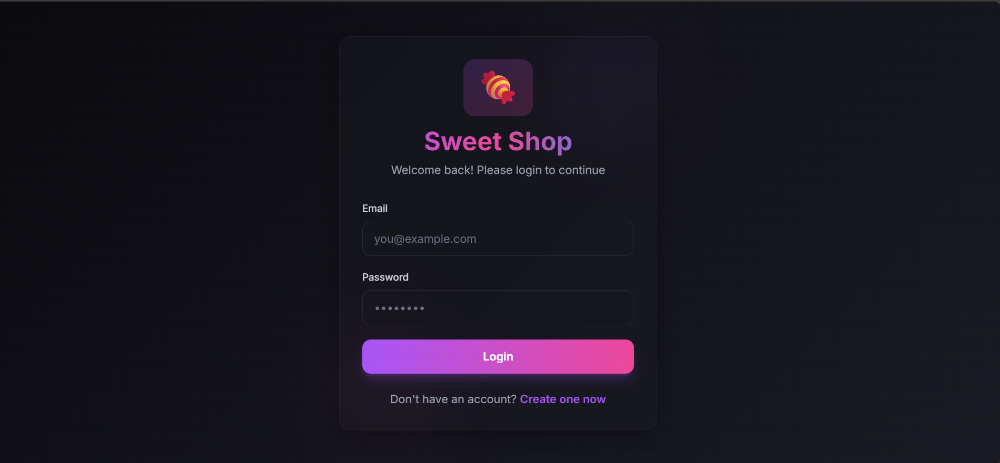
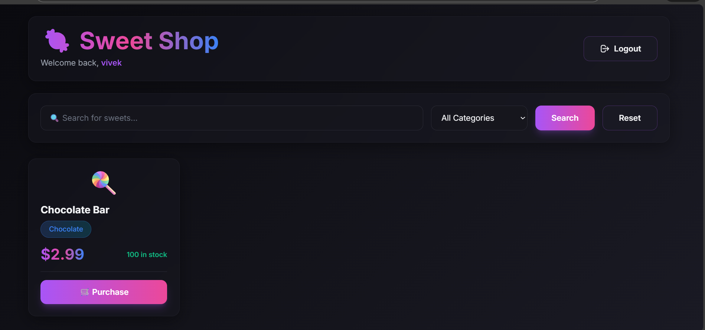

# 🍬 Sweet Shop Management System

A full-stack web application for managing a sweet shop, built with Test-Driven Development (TDD) principles.

## 🚀 Features

### Backend API
- **User Authentication**: JWT-based authentication with registration and login
- **Sweets Management**: Full CRUD operations for sweets inventory
- **Search Functionality**: Search sweets by name, category, and price range
- **Inventory Management**: Purchase and restock operations
- **Role-Based Access**: Admin-only endpoints for sensitive operations

### Frontend
- **User Authentication**: Registration and login with form validation
- **Sweets Dashboard**: Browse all available sweets with search and filter
- **Purchase System**: Buy sweets with real-time quantity updates
- **Admin Panel**: Add, update, delete, and restock sweets (admin only)
- **Responsive Design**: Beautiful, modern UI with Tailwind CSS

## 🛠️ Technology Stack

### Backend
- **Runtime**: Node.js with TypeScript
- **Framework**: Express.js
- **Database**: SQLite with Prisma ORM
- **Authentication**: JWT (jsonwebtoken) + bcrypt
- **Testing**: Jest + Supertest
- **API Documentation**: RESTful API

### Frontend
- **Framework**: React 18 with TypeScript
- **Build Tool**: Vite
- **Routing**: React Router DOM
- **HTTP Client**: Axios
- **Styling**: Tailwind CSS
- **State Management**: React Context API

## 📋 Prerequisites

- Node.js (v18 or higher)
- npm or yarn
- Git

## 🔧 Installation & Setup

### 1. Clone the Repository

```bash
git clone <repository-url>
cd assignment
```

### 2. Backend Setup

```bash
cd backend

# Install dependencies
npm install

# Set up environment variables
cp .env.example .env
# Edit .env if needed (default values work for local development)

# Generate Prisma client and run migrations
npm run prisma:generate
npm run prisma:migrate

# Run tests
npm test

# Start the development server
npm run dev
```

The backend API will be running at `http://localhost:3000`

### 3. Frontend Setup

```bash
cd frontend

# Install dependencies
npm install

# Start the development server
npm run dev
```

The frontend will be running at `http://localhost:5173`

## 🧪 Running Tests

### Backend Tests

```bash
cd backend

# Run all tests
npm test

# Run tests with coverage
npm run test:coverage

# Run specific test file
npm test -- auth.test.ts
```

**Test Coverage**: 46 tests across 3 test suites
- Authentication: 11 tests
- Sweets CRUD: 20 tests
- Inventory Management: 15 tests

## 📡 API Endpoints

### Authentication
- `POST /api/auth/register` - Register a new user
- `POST /api/auth/login` - Login user

### Sweets (Protected)
- `GET /api/sweets` - Get all sweets
- `GET /api/sweets/search` - Search sweets (query params: name, category, minPrice, maxPrice)
- `POST /api/sweets` - Create a new sweet (requires authentication)
- `PUT /api/sweets/:id` - Update a sweet (requires authentication)
- `DELETE /api/sweets/:id` - Delete a sweet (admin only)

### Inventory (Protected)
- `POST /api/sweets/:id/purchase` - Purchase a sweet (requires authentication)
- `POST /api/sweets/:id/restock` - Restock a sweet (admin only)

## 👤 User Roles

- **First User**: Automatically assigned as admin
- **Subsequent Users**: Regular users with purchase permissions
- **Admin**: Full access to all operations including delete and restock

## 🎨 Screenshots

### Login Page


### Dashboard


### Admin Panel


## 🤖 My AI Usage

### AI Tools Used

I made limited and selective use of **Google Gemini** during this project, mainly as a reference and support tool rather than a primary development driver.

## How I Used AI

### 1. Concept Clarification & Planning
- Used Gemini occasionally to clarify architectural decisions and compare alternatives  
  (e.g., understanding trade-offs between SQLite and PostgreSQL)
- Helped validate my project structure and implementation plan after I had already drafted it

### 2. Testing Support
- Used AI sparingly to:
  - Review test cases I had written and suggest potential edge cases
  - Cross-check test structure for correctness and completeness
- All final test logic, assertions, and fixes were written and adjusted manually based on test results

### 3. Backend Development
- Referred to Gemini as a secondary reference while:
  - Designing the Prisma schema and defining relationships
  - Implementing authentication and authorization logic
- AI suggestions were primarily used to confirm best practices, not to directly copy implementations
- Core logic, debugging, and refactoring were handled manually

### 4. Frontend Development
- Used AI occasionally to:
  - Validate React component structure
  - Get suggestions for Tailwind CSS utility classes
- UI structure, state management, and validation logic were implemented and refined independently

### 5. Debugging & Issue Resolution
- AI was used as a troubleshooting aid when:
  - Identifying SQLite limitations during testing
  - Resolving database locking and CORS configuration issues
- Root cause analysis and final fixes were implemented manually after understanding the problem

### 6. Documentation
- AI was used lightly to:
  - Improve clarity and structure of README sections
  - Review explanations for accuracy and readability
- All documentation reflects my own understanding of the system and its behavior


## Reflection on AI Usage

### What AI Helped With
- **Reference & Validation**: Helped confirm design decisions and commonly accepted best practices
- **Efficiency**: Reduced time spent searching documentation for standard patterns
- **Learning Support**: Assisted in clarifying concepts such as JWT authentication and ORM usage

### What Was Done Manually
- Project architecture and feature implementation
- Writing, running, and fixing test cases
- Debugging runtime and integration issues
- Final code structure and refactoring decisions

### Key Takeaway
AI was used as a supporting tool, similar to documentation or community resources like Stack Overflow, rather than as a code-generation engine. The project was primarily designed, implemented, tested, and debugged through manual effort and problem-solving, with AI serving only as an occasional guide.

### Examples of Limited AI Assistance
- Reviewing test coverage and suggesting missed edge cases
- Providing Tailwind CSS utility suggestions for UI polish
- Confirming error-handling patterns
- Helping rephrase documentation for clarity

### Statement of Responsibility
All core logic, implementation, testing, and debugging were performed manually.  
AI assistance was used minimally and only for guidance or verification purposes.  
The final codebase reflects my own understanding and effort.

## 📝 Development Workflow (TDD)

This project strictly followed Test-Driven Development:

1. **RED**: Write failing tests first
2. **GREEN**: Implement minimal code to pass tests
3. **REFACTOR**: Improve code quality while keeping tests green

Each feature has separate commits for RED and GREEN phases, visible in the git history.

## 🔐 Security Considerations

- Passwords are hashed using bcrypt (10 rounds)
- JWT tokens expire after 7 days
- Admin-only routes are protected with role-based middleware
- Input validation on all endpoints
- SQL injection prevention through Prisma ORM

## 🚀 Future Enhancements

- [ ] Add user profiles and order history
- [ ] Implement payment gateway integration
- [ ] Add product images and categories
- [ ] Deploy to production (Vercel + Railway)
- [ ] Add email notifications
- [ ] Implement shopping cart functionality
- [ ] Add product reviews and ratings

## 📄 License

MIT

## 👨‍💻 Author

Developed as part of a TDD Kata assessment, demonstrating full-stack development skills with modern technologies and AI-assisted development practices.

- BY VIVEK 
- 2221133
- B.TECH CSE 2026 BATCH
- CGC COE LANDRAN

## PORTFOLIO LINK - 
#### Do explore other works too - 

https://rimuru2725.github.io

---

**Note**: This project was developed with AI assistance (Google Gemini). All AI contributions are documented in the "My AI Usage" section and in git commit co-author attributions.
